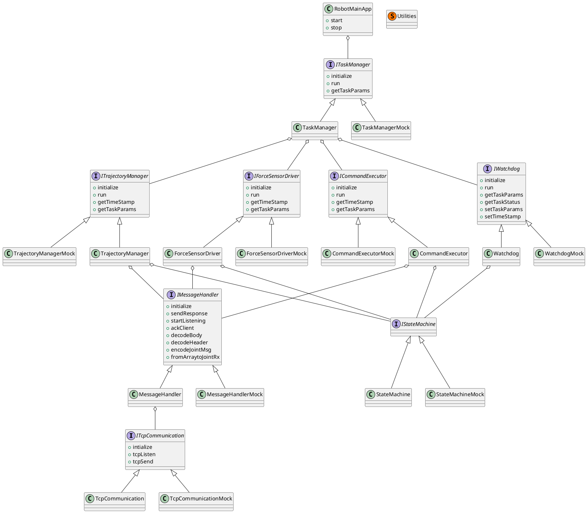
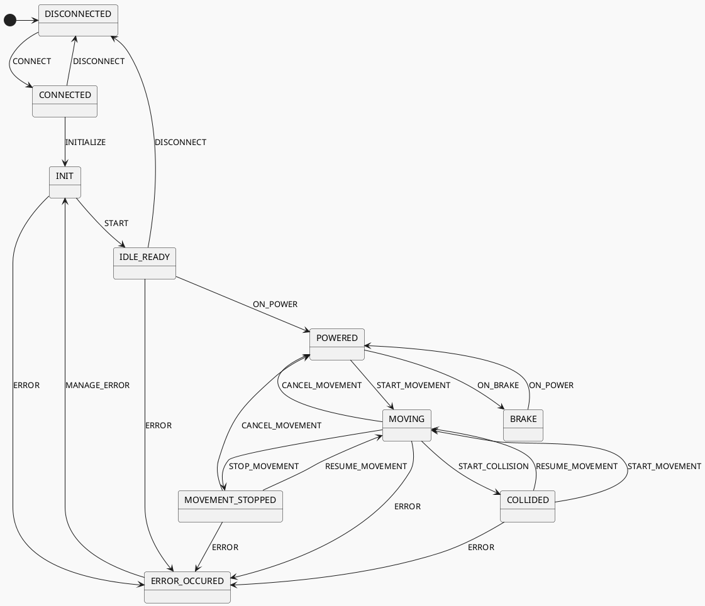

# Revision

| Rev. | Description | Date | Author |
|------|-------------|------|--------|
| A | First version | 05-DEC-2022 | MF. Aouachria |
|  |  |  |  |
|  |  |  |  |
|  |  |  |  |

# Signature

| Role | Name | Title | Signature |
|------|------|-------|-----------|
|  |  |  |  |
|  |  |  |  |
|  |  |  |  |
|  |  |  |  |

[[_TOC_]]

# Robot Application software item presentation

The Robot Application software item runs on the CS9 controller and is programed in VAL3. It has three main functions:

- Receive commands from the LupinPrep software item, and send back responses and data about the robot.
- Get data and status from the F/T sensor. ...

## VAL3 scripting language

## Analogy with C++

VAL3 is the scripting language developed by Stäubli. It enables the user to control the robot through API calls. A software in VAL3 is organized in applications. The following analogy between VAL3 and C++ can be made:

| C++ | VAL3 | Comments |
|-----|------|----------|
| class | application | An application contains data and programs. |
| method | program | List of VAL3 commands. |
| attribute | data | A data has a type (the existing types are listed below and can be a single instance, an array of a collection (dictionary). |

An application can also be used by another application as an external library of data and programs. Thus, data and programs can be defined as public (accessible by other applications) or private.

### Type of Data in VAL3

The existing type of data in VAL3 are:

| Type | Meaning | Comments |
|------|---------|----------|
| aio | analogic I/O |  |
| bool | boolean |  |
| configRx | Staubli TX robot configuration | Configuration of the shoulder, elbow and wrist |
| dio | digitalI/O | A data has a type (the existing types are listed below and can be a single instance, an array of a collection (dictionary). |
| frame | pose | Expressed relatively to another frame. “World” is the global frame. |
| jointRx | Stäubli TX robot joint configuration | Angular value of the 6 joints of the robot. |
| mdesc | motion description | Define the acceleration, deceleration and maximal speed for a robot move. |
| num | numerical | In VAL3, there is no difference between integer or float |
| pointRx | Stäubli TX robot pose and configuration | Uniquely defines the robot position, orientation and branch of configuration(Shoulder left or right, elbow positive or negative, wrist positive or negative |
| sio | socket I/O |  |
| string | character string |  |
| tool | parameter defining a tool geometry |  |
| trsf | geometric transformation | Array of 6 num. |

### Executing an application

At start, the CS9 firmware automatically calls a program named start() in the application configured with the “AutoStart” flag. In our case, the application “RobotMainApp” is the entry point of the Robot Application software item. This application will in turn, start other programs in parallel tasks (See chapter 2).

In VAL3, a task can be synchronous or asynchronous. Synchronous means that the execution of the task is scheduled at a fixed period, while asynchronous means that the task will be executed in the remaining available CPU time. The time sharing between several asynchronous tasks in determined according to their priority.

# Applications documentation

## Architecture

### UML Diagram

### Sequence Diagram

### State Machine

## Application List
